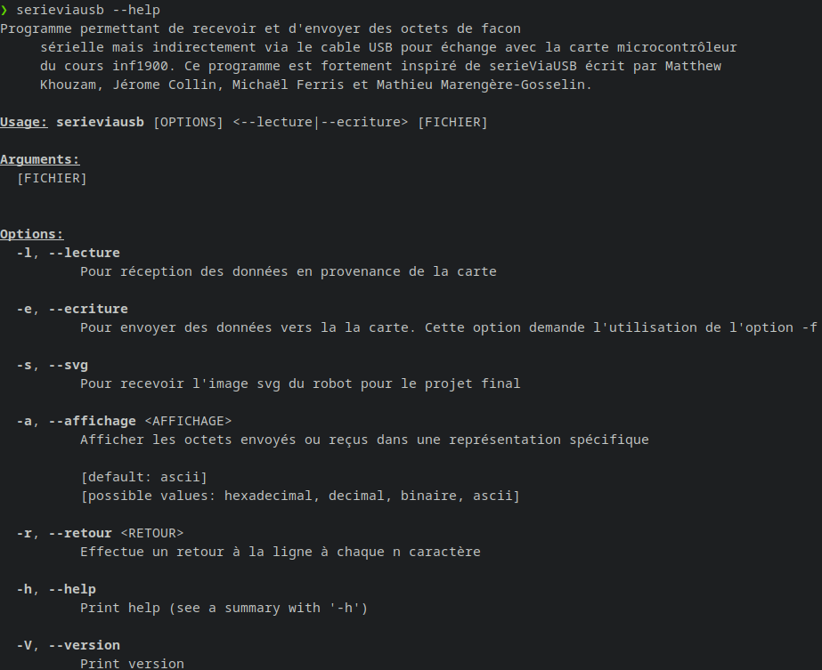
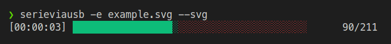
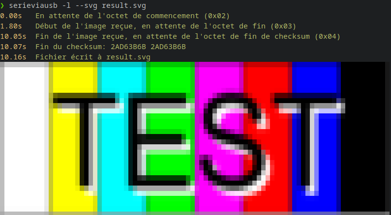

# serieViaUSB en Rust + lecture SVG
Ce programme est une réimplémentation du programme serieViaUsb du cours [INF1900](https://cours.polymtl.ca/inf1900/).

## Compatibilité avec serieViaUsb
Ce programme n'est pas conçu pour reproduire fidèlement les options de serieViaUsb, mais il est similaire dans ce qu'il offre en terme de fonctionnalité.

## Fonctionnalitées
- Multiplateforme Mac et Linux
- Gère les interruptions par ctrl-c
- Inclus une option pour écrire/lire du svg
- Peut faire un rendu d'un aperçu du svg dans le terminal
- Contient de la couleur
- Peut enregistrer le svg dans un fichier
- Peut convertir le svg en png et l'enregistrer dans un fichier

## Screenshots

